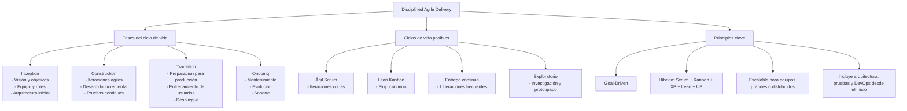

```mermaid
flowchart TD
    A[Disciplined Agile Delivery] --> B[Fases del ciclo de vida]
    A --> C[Ciclos de vida posibles]
    A --> D[Principios clave]

    %% Fases
    B --> B1[Inception\n- Visión y objetivos\n- Equipo y roles\n- Arquitectura inicial]
    B --> B2[Construction\n- Iteraciones ágiles\n- Desarrollo incremental\n- Pruebas continuas]
    B --> B3[Transition\n- Preparación para producción\n- Entrenamiento de usuarios\n- Despliegue]
    B --> B4[Ongoing\n- Mantenimiento\n- Evolución\n- Soporte]

    %% Ciclos de vida
    C --> C1[Ágil Scrum\n- Iteraciones cortas]
    C --> C2[Lean Kanban\n- Flujo continuo]
    C --> C3[Entrega continua\n- Liberaciones frecuentes]
    C --> C4[Exploratorio\n- Investigación y prototipado]

    %% Principios
    D --> D1[Goal-Driven]
    D --> D2[Híbrido: Scrum + Kanban + XP + Lean + UP]
    D --> D3[Escalable para equipos grandes o distribuidos]
    D --> D4[Incluye arquitectura, pruebas y DevOps desde el inicio]
```
